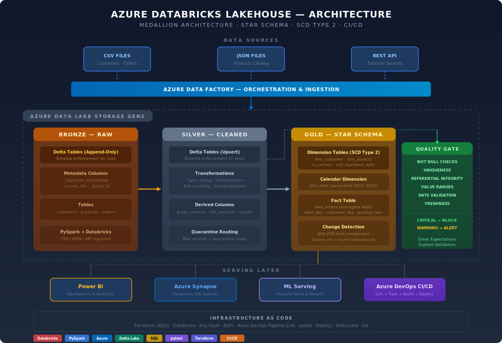

# Azure Databricks Lakehouse — Medallion Architecture

[](https://dev.azure.com/)
[](https://python.org)
[](https://databricks.com)
[](LICENSE)

An end-to-end **production-grade data lakehouse** built on Azure Databricks using the **Medallion Architecture** (Bronze → Silver → Gold), featuring **Star Schema** dimensional modeling with **SCD Type 2** historical tracking, automated **data quality validation**, and a full **CI/CD pipeline**.

---

## Architecture



## Data Model — Gold Layer (Star Schema)

```
                    ┌──────────────────┐
                    │   dim_date       │
                    │──────────────────│
                    │ date_key (PK)    │
                    │ full_date        │
                    │ year / quarter   │
                    │ month / week     │
                    │ day_of_week      │
                    │ is_weekend       │
                    └────────┬─────────┘
                             │
┌──────────────────┐         │         ┌──────────────────────┐
│  dim_customer    │         │         │   dim_product        │
│──────────────────│         │         │──────────────────────│
│ customer_key(PK) │         │         │ product_key (PK)     │
│ customer_id (BK) │         │         │ product_id (BK)      │
│ name / email     │    ┌────┴────┐    │ name / category      │
│ segment / region │────│  fact_  │────│ price / brand        │
│ scd_start_date   │    │ orders  │    │ scd_start_date       │
│ scd_end_date     │    │─────────│    │ scd_end_date         │
│ is_current       │    │order_key│    │ is_current           │
└──────────────────┘    │date_key │    └──────────────────────┘
     (SCD Type 2)       │cust_key │         (SCD Type 2)
                        │prod_key │
                        │quantity │
                        │revenue  │
                        │discount │
                        └─────────┘
```

## Project Structure

```
azure-databricks-lakehouse/
├── README.md                          # You are here
├── notebooks/                         # Databricks notebooks (execution entry points)
│   ├── 01_bronze_ingestion.py         # Raw data ingestion to Bronze
│   ├── 02_silver_transformation.py    # Cleaning & validation to Silver
│   ├── 03_gold_star_schema.py         # Dimensional modeling to Gold
│   └── 04_data_quality_checks.py      # Quality gate orchestration
├── src/                               # Modular Python source code
│   ├── transformations/               # ETL transformation logic
│   │   ├── bronze.py                  # Bronze layer ingestion
│   │   ├── silver.py                  # Silver layer transformations
│   │   └── gold.py                    # Gold layer star schema builder
│   ├── data_quality/                  # Data quality framework
│   │   └── validators.py             # Validation rules engine
│   ├── models/                        # Data modeling utilities
│   │   ├── star_schema.py            # Star schema DDL & helpers
│   │   └── scd_type2.py             # SCD Type 2 implementation
│   └── utils/                         # Shared utilities
│       └── helpers.py                # Config loader, logger, spark session
├── tests/                             # Unit & integration tests
│   ├── test_transformations.py       # Tests for ETL logic
│   ├── test_data_quality.py          # Tests for validation rules
│   └── test_scd.py                   # Tests for SCD Type 2 logic
├── infrastructure/                    # Infrastructure as Code
│   ├── terraform/                     # Azure resource provisioning
│   │   └── main.tf                   # ADLS, Databricks, Key Vault
│   └── azure-devops/                  # CI/CD pipeline definition
│       └── pipeline.yml              # Build, test, deploy stages
├── config/                            # Configuration files
│   ├── pipeline_config.yaml          # Pipeline settings & paths
│   └── data_quality_rules.yaml       # Quality rules definition
├── data/sample/                       # Sample datasets for testing
│   ├── customers.csv
│   ├── products.json
│   └── orders.csv
├── docs/                              # Documentation
│   └── data_dictionary.md            # Column-level documentation
├── scripts/                           # Utility scripts
│   └── setup_env.sh                  # Environment setup helper
├── .gitignore
├── requirements.txt
├── setup.py
├── Makefile                           # Common dev commands
└── LICENSE
```

## Tech Stack

| Layer | Technology | Purpose |
|-------|-----------|---------|
| **Storage** | Azure Data Lake Storage Gen2 | Scalable cloud storage (Bronze/Silver/Gold) |
| **Processing** | Databricks + Apache Spark (PySpark) | Distributed data processing |
| **Table Format** | Delta Lake | ACID transactions, time travel, schema enforcement |
| **Orchestration** | Azure Data Factory | Pipeline scheduling & monitoring |
| **Data Modeling** | Star Schema + SCD Type 2 | Dimensional warehouse modeling |
| **Data Quality** | Great Expectations + custom validators | Automated quality checks |
| **CI/CD** | Azure DevOps Pipelines | Automated build, test, deploy |
| **IaC** | Terraform | Azure resource provisioning |
| **Visualization** | Power BI | Business dashboards |
| **Testing** | pytest + chispa (Spark testing) | Unit & integration tests |

## Quick Start

### Prerequisites

- Python 3.10+
- Azure account with Databricks workspace
- Azure CLI installed and configured

### Local Development

```bash
# Clone the repository
git clone https://github.com/<your-username>/azure-databricks-lakehouse.git
cd azure-databricks-lakehouse

# Create virtual environment
python -m venv .venv
source .venv/bin/activate  # Linux/Mac
# .venv\Scripts\activate   # Windows

# Install dependencies
pip install -r requirements.txt

# Run tests
make test

# Run linting
make lint
```

### Deploy to Databricks

```bash
# Configure Databricks CLI
databricks configure --token

# Deploy notebooks
databricks workspace import_dir ./notebooks /Repos/lakehouse-project

# Run the pipeline
databricks jobs create --json-file config/job_definition.json
```

## Pipeline Execution Order

```
01_bronze_ingestion.py    →  Raw data lands in Delta tables (append-only)
        ↓
02_silver_transformation.py →  Cleaned, deduplicated, schema-enforced
        ↓
04_data_quality_checks.py  →  Validation gate (blocks pipeline on failure)
        ↓
03_gold_star_schema.py     →  Star schema with SCD Type 2 dimensions
```

## Key Design Decisions

1. **Delta Lake over Parquet** — ACID transactions, schema evolution, and time travel for auditing
2. **SCD Type 2 on dimensions** — Full historical tracking for customer and product changes (critical for analytics accuracy)
3. **Data quality as a pipeline gate** — Quality checks run between Silver and Gold; pipeline halts on critical failures
4. **Modular source code** — Notebooks call functions from `src/` for testability; no business logic lives in notebooks
5. **Idempotent pipelines** — Every layer can be safely re-run without duplicating data (merge-based upserts)

## Data Quality Rules

| Rule | Layer | Action on Failure |
|------|-------|-------------------|
| Schema validation | Bronze → Silver | Quarantine bad records |
| Null check (required fields) | Silver | Block pipeline |
| Referential integrity | Gold | Block pipeline |
| Uniqueness (business keys) | Silver | Deduplicate + alert |
| Freshness (data age < 24h) | All layers | Alert |
| Row count anomaly (±30%) | Silver | Alert |

## CI/CD Pipeline

The Azure DevOps pipeline runs on every push to `main` or PR:

```
┌─────────┐    ┌──────────┐    ┌──────────┐    ┌──────────┐
│  Lint   │ →  │  Unit    │ →  │ Integration│ → │  Deploy  │
│ (ruff)  │    │  Tests   │    │  Tests     │    │ (Prod)   │
│         │    │ (pytest) │    │ (Staging)  │    │          │
└─────────┘    └──────────┘    └──────────┘    └──────────┘
```

## License

MIT License — see [LICENSE](LICENSE) for details.
